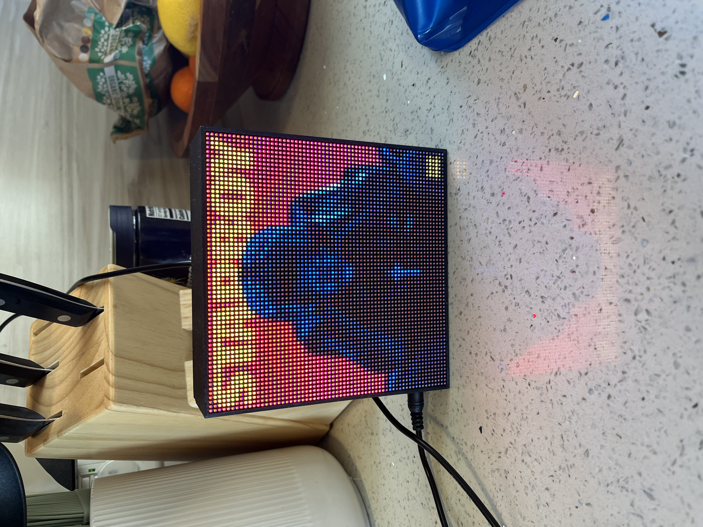

# Spotify Display

A production grade IOT product that displays your current playback on a low pixel display.



## Hardware

I've used a Pi-Zero W but it is a little slow, you need good thermal distribution for the SOC die or it will throttle itself under load (which is always given we are always running). 
You could use a faster Pi like a Pi3 or something, although that is likely overkill. The single core CPU on the Pi Zero hits ~75% average usage when running
the script and powering the 64x64 display. You can pick up display hardware at Adafruit or a similar site and I won't go into the wiring, as that is well documented elsewhere including the 
`rpi-rgb-led-matrix` library that is used in this project. I will caution against 32x32 displays as the album art is hard to read.

## Installation

Begin by building the [rpi-rgb-led-matrix](https://github.com/hzeller/rpi-rgb-led-matrix/blob/master/bindings/python/README.md) library Python bindings onto your machine.
I have included the already built artifacts, but you may need more up to date binaries. We also need a virtual environment to run our Python code, so:

```bash
virtualenv venv
source venv/bin/activate
pip install -r requirements.txt
deactivate
```

The `rpi-rgb-led-matrix` library needs root level access in order to schedule hardware timings, so we will run the program using:

```bash
sudo venv/bin/python ./spotify-display.py
```

## Scheduling Auto-Start

If you are using bookworm, or really any other device with systemd as a process scheduler you can copy the file `startup/spotifydisplay.service` into the `/etc/systemd/system` directory to run the program as a service.
This will enable automatic running on program failure including retries, and allow us to run the process on boot. Once copied over:

```bash
sudo systemctl start spotifydisplay.service
sudo systemctl enable spotifydisplay.service
```
