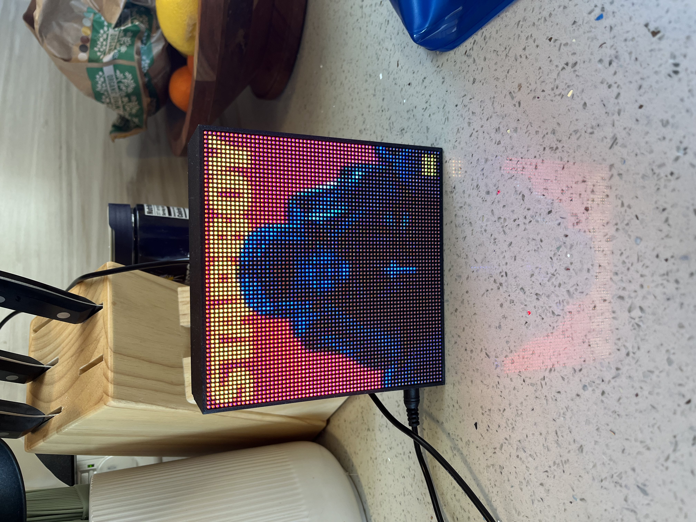

# Spotify Display

A 64×64 LED matrix that shows your current Spotify album art, and falls back
to a daily weather forecast (with a clock) when nothing is playing.



## Hardware

Raspberry Pi Zero W (single-core ARMv6) driving a 64×64 RGB LED matrix via
[rpi-rgb-led-matrix](https://github.com/hzeller/rpi-rgb-led-matrix). Anything
faster works too. A 32×32 panel is not recommended — album art becomes
unreadable.

Recommended OS: **Raspberry Pi OS Lite, 32-bit (ARMv6)**. The desktop image
runs background services that compete with the matrix's realtime render
thread for the single core.

## Install

Dependencies:

```bash
sudo apt install build-essential libcurl4-openssl-dev nlohmann-json3-dev
```

Clone and build the matrix lib, **pinned to a commit before the upstream Pi 5
RP1 backend was added** (which ships inline ARMv7 atomics that the Pi Zero's
ARMv6 assembler refuses):

```bash
git clone https://github.com/hzeller/rpi-rgb-led-matrix.git ~/rpi-rgb-led-matrix
git -C ~/rpi-rgb-led-matrix checkout e947417
make -C ~/rpi-rgb-led-matrix/lib
```

Then clone this repo, install the systemd unit, and write the device env file:

```bash
git clone https://github.com/mrrosoff/Spotify-Display.git ~/Spotify-Display
cd ~/Spotify-Display
sudo install -m 0644 startup/spotifydisplay.service /etc/systemd/system/
sudo install -m 0600 startup/spotifydisplay.env.example /etc/spotifydisplay.env
sudo systemctl daemon-reload
```

Edit `/etc/spotifydisplay.env` and set `SPOTIFY_DEVICE_TOKEN` to this device's
secret (the value stored at SSM `/website/spotify/device-secret`). The Pi never
holds Spotify credentials — it fetches short-lived access tokens from the token
broker on `maxrosoff.com`. To (re)authorize the broker with a Spotify account,
run `sudo spotify` in the website terminal. Then:

```bash
make
sudo systemctl enable --now spotifydisplay
sudo journalctl -u spotifydisplay -f
```

The Makefile downloads `stb_image.h` on first build (single-header JPEG/PNG
decoder for album art). Override `RGB_LIB_DISTRIBUTION` if the matrix lib
lives somewhere other than `~/rpi-rgb-led-matrix`.

## Behavior

- Polls Spotify every 5 s; shows album art while a track plays, with a
  paused-state overlay (50% dim + bottom-right pause icon) when applicable
  and a column-wipe transition when the track changes.
- After 30 s with no playback, switches to the weather screen, which shows
  the date, a clock in the top-right, the day's high/low/precipitation, and
  the condition word.
- Weather refreshes every 30 min from open-meteo (San Diego coordinates).
- Between 10:30 PM and midnight, shows tomorrow's forecast; from midnight
  to 7 AM, shows the current day.
- Dims the panel from 100 → 40 between 10:30 PM and 7 AM.

## Notes on a Pi Zero W

The matrix lib starts a SCHED_FIFO priority-99 render thread that consumes
~80% of the single core continuously. The kernel's network softirqs and
userspace threads (sshd, our curl calls) get whatever's left. In practice:

- SSH sessions can take a long time to complete the handshake while the
  service is running; usually they do eventually land. Persisting through
  one or two `Connection closed` retries works.
- HTTP timeouts are intentionally generous (60 s connect / 120 s read).
- We use one main thread for all rendering and network polling — no
  concurrent outbound calls. Weather and Spotify polls are sequenced so
  they never share the kernel's network stack at the same instant.

If SSH genuinely won't land and you need to recover the Pi:

1. Mask the unit before next boot by editing `bootfs/cmdline.txt` (FAT
   partition, readable from a regular computer): append a space and
   `systemd.mask=spotifydisplay.service` at the end of the single line.
2. Reinsert + boot. The service is now masked; SSH stays responsive.
3. From SSH, `sudo systemctl stop spotifydisplay`, `sudo rm
   /etc/systemd/system/multi-user.target.wants/spotifydisplay.service`
   (bypasses the mask refusal), edit `cmdline.txt` back, reboot.

## Disable the built-in audio driver

The matrix lib uses the BCM2835 hardware PWM for pixel timing, which
conflicts with the Pi's built-in audio driver. Blacklist it once:

```bash
echo "blacklist snd_bcm2835" | sudo tee /etc/modprobe.d/blacklist-rgb-matrix.conf
sudo rmmod snd_bcm2835 || true
```

If you don't, the binary exits at startup with a message about the sound
module being loaded.

## Deploy updates

```bash
sudo systemctl stop spotifydisplay
git pull && make
sudo systemctl start spotifydisplay
```
